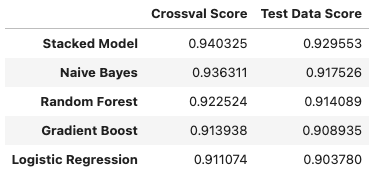

## Introduction

The global digital music content market size was estimated at 15.63 billion dollars in 2022 and is projected to have a [compound annualized growth rate (CAGR) of 9.82%](https://www.businesswire.com/news/home/20220517005741/en/The-Worldwide-Digital-Music-Content-Industry-is-Expected-to-Reach-25-Billion-by-2027---ResearchAndMarkets.com) over the next 5 years.  Within this industry, music producers commonly use Digital Audio Workstations (DAWs) such as [Ableton Live](https://www.ableton.com/en/shop/live/), and music composers commonly use scorewriter software such as [Sibelius](https://www.avid.com/sibelius).  The music software industry is also rather large: in 2021, the global DAW market size was estimated at [2.49 billion dollars](https://www.fortunebusinessinsights.com/industry-reports/digital-audio-workstation-market-100150), with an estimated CAGR of 9% over the next seven years.

To sell the correct type of software to a person expressing interest in making music, one must determine whether that person identifies as a "Composer" - a person likely interested in scorewriter software - or a "Producer" interested in a DAW.  While it may often be easy to make this distinction after talking to a potential customer, automated digital marketing requires making intelligent automated guesses about whether a person is a Composer or a Producer based on message data from that person.

Towards the end of distinguishing potential customers based on their messages, in this project we build classification models to automatically determine whether an unknown Reddit post comes from [r/composer](https://www.reddit.com/r/composer/) ("Composers") and [r/musicproduction](https://www.reddit.com/r/musicproduction/) ("Producers").  We use the [Python Reddit API Wrapper](https://praw.readthedocs.io/en/stable/) (PRAW) to scrape over 1000 Reddit submissions ("posts") from each of these two subreddits.  We explore several methods of preprocessing the text data, such as removing "stop words," stemming/lemmatizing words, and using Regular Expressions to extract URLs and replace them with their website names.  We then train and tune a variety of "bag of words"-style classification models on the text data, evaluating these models based on their cross-validated accuracy scores from the training data and later validating the best-performing models with unseen test data.

## Main Results

We find that several different classification models have high (over 90%) accuracy after proper training and tuning.  Our best-perofrming model (in terms of cross-val accuracy on the training data) was a "stacked" model built from a Multinomial Naive Bayes classifier, a Random Forest classifier, a Gradient Boosted Decision Trees classifier, and a Logistic Regression.  The cross-val accuracy scores of each of these models, as well as their test data accuracy scores, appear below.

Overall, we found that proper preprocessing of text data significantly improved the models' performance; for example, URL processing reduced misclassification rates by as much as 15-25%.  Stacking our different well-performing models also reduced misclassification significantly, as is apparent from the table above.

One of these models' primary shortcomings is that the methods used to preprocess the text data do not take advantage of the *relative* frequencies of different words among each of the two subreddits.  Indeed, when selecting the "most important words" from text, vectorizers such as `sklearn`'s `CountVectorizer` select words based on their *overall* frequency among the entire corpus of text (i.e., across both subreddits).  A more informed method of feature selection would instead select those words that have high *relative* frequency in one subreddit as compared to in the other, since these words are likely to be strong indicators of one particular subreddit.  Indeed, we find that a sizeable share of our best model's misclassified posts contain words that should be e.g. strong indicators of "Composers" but did not appear frequently enough in the corpus to be considered at all.  Although we don't explore feature selection based on *relative frequency* in this project, we begin some analysis based on this technique in the [experimental code](./code/experimental/frequency_ratio_modeling.ipynb).

